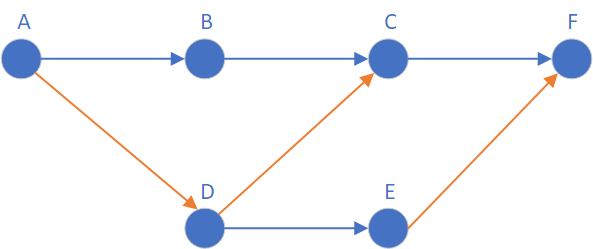
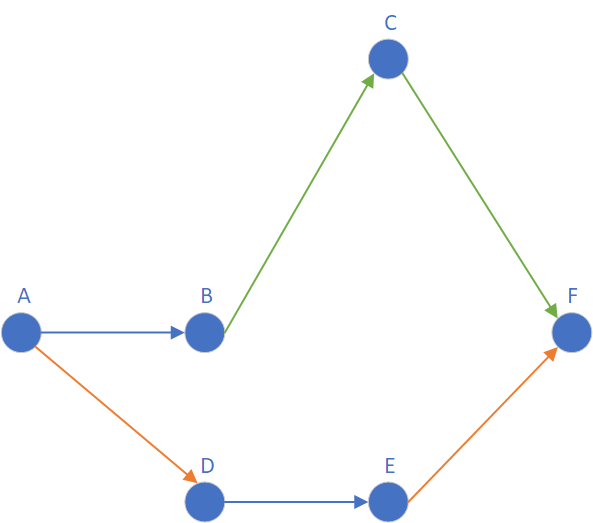
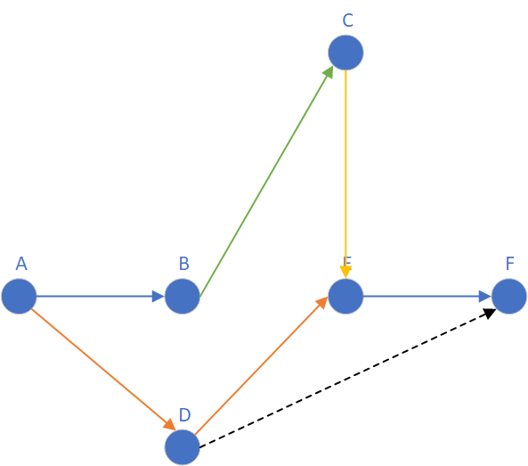
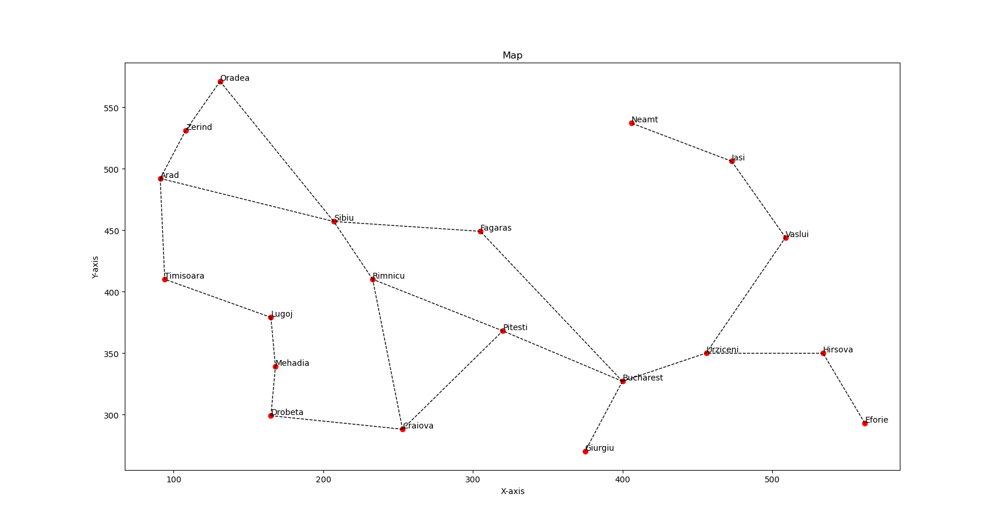
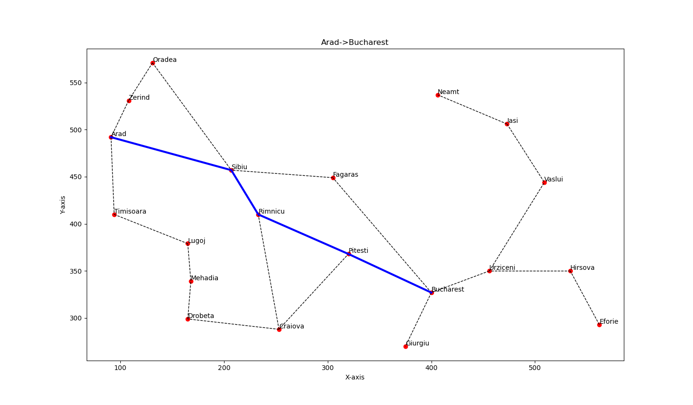
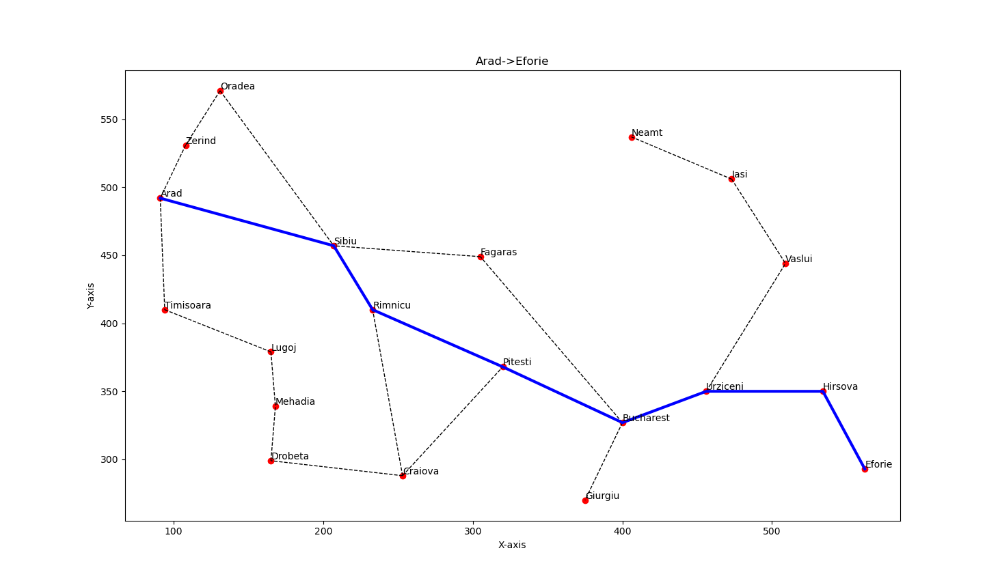
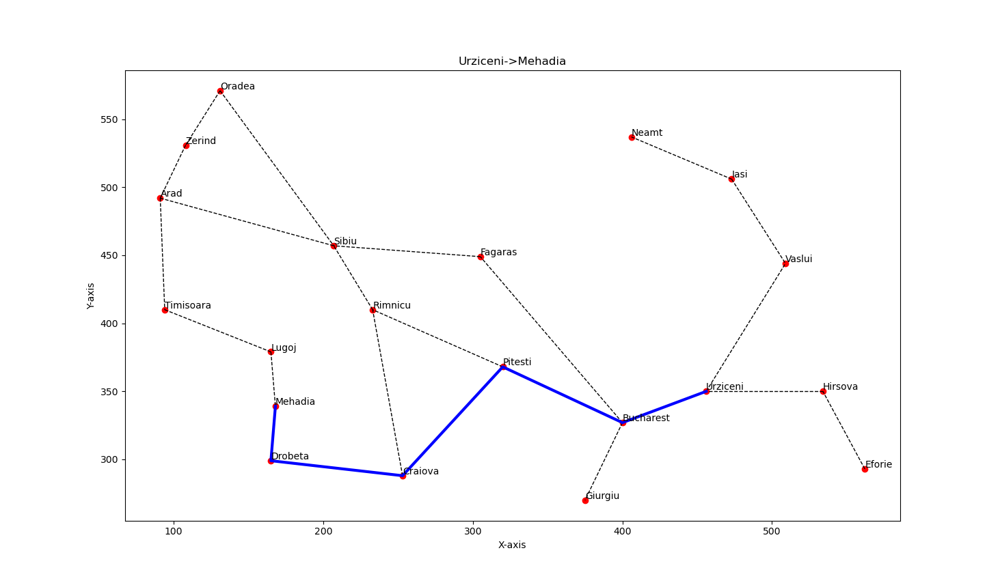
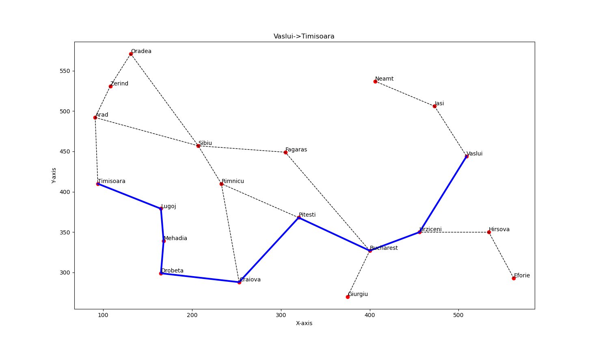

# 罗马尼亚A*算法

最近老师也是布置了作业啊，代码实现罗马尼亚A*算法，对于我这种常年坐在后排玩手机的同学来说，又是一场酣畅淋漓的自学啊，但是网上的讲解和代码，我感觉不是很直观，看来好久才看懂，而且中间还理解错了，因此这里从头理了一遍罗马尼亚A\*算法，我认为讲解还是比较直观的。

---

## 1、罗马尼亚A*算法简介

网络上的A*算法讲解有很多，但大多数都不直观，因此本文将从最简单的例子出发，直观的理解A\*算法。

而且网上的代码，大多数写死了，只能计算它给的两个点（“Arad 到 Bucharest”）（因为它只给了各个点到Bucharest的欧式距离），但是既然有坐标，那应该所有的坐标点都能实现，顺便再写了个结果可视化的代码，仅供大家参考。

**我将尝试从问题出发，一步一步从头开始尝试设计罗马尼亚A*算法。**

思考一个简单的例子，我们现在要**从A走到F**，显然的，有**ABCF**、**ADE**和**ADCF**三条路可以选择，从直观上看，显然**ABCF**更短，但如何让计算机去找到这个最短路径呢，这显然就是一个问题。

### 1.1 损失函数（估价函数）的设计

为量化距离，我们假设**蓝色线段距离为1，黄色线段距离为2。**我们模拟计算机，从A点出发，首先想到可以走**AB和AD**两条路。那么那一条路到达**F**更进一点呢？我们在**A点**可以明确的确定到**B**和到**D**的距离（即知道**AB和AD**），但我们不知道从**B到F**和**D到F**谁更近，要是我们知道了**B到F**和**D到F**谁更近，那么问题就解决了，将**A点**到**B**和到**D**的距离加上**B到F**或**D到F**的距离，算出结果谁更小，那么就选择谁。因此问题的关键就是在于找到一种方法，去刻画（预测）**B到F和D到F的距离。**并且刻画的距离，应该小于等于实际距离[1]。那么我们自然而然的就想到，有欧式距离去刻画。



因此，我们就理解了罗马尼亚A*算法损失函数的来源了，即某个节点（我们就叫节点N）的损失（这个损失就是从A（start）到F（end）经过N节点要走的距离），为**A到N已经走过的距离，加上N到F的预估距离（一般为欧式距离）。**

我们将上述损失函数写成公式，即使为$f(n)=g(n)+h(n)$，式子中$g(x)$即为A到N已经走过的距离，$h(x)$即为N到F的预估距离（一般为欧式距离）。注意这里的$f(n)$是表示一条路径的损耗，不是一个节点的损耗，只不过这条路径经过了这个节点，以这个节点为界，之前的距离我们知道，写作$g(n)$，之后的距离不知道，估计为$h(n)$，节点没有损耗，因此一个节点可以有多个$f(n)$。

例如$$f(c1)=(AB+BC)+h(n)$$，$$f(c2)=(AD+DC)+h(n)$$。

ok，讲到这里，我们惊讶的发现，我们已经完成了启发式算法中一个重要的步骤，设计损失函数。接下来我们还需要设计**迭代方法和终止条件，**就可以完成一个启发式算法的设计了。

### 1.2 迭代方法的设计

迭代方法是一个重要设计，它决定了我们算法的性能。最简单最暴力的思想就是，我们每个节点都可以计算一个或者多个$f(n)$[2]。这样从A到。但这样未免太过于暴力，计算量很大。因此我们从头出发。当站在**A点**时候，我们可以走**AB和AD**两条路，那么这个时候，走**AB和AD**的两个$f(n)$，就已经可以计算出来了，这个时候我们就可以进行一个比较，明显走**B点**的$f(b)$小于走**D点**的$f(d)$，那么我们就可以先放弃走**D**点的路劲，下一步走到**B点**，**B点**可以走到**A和C点**，因此我们再考虑**A和C**的$f(n)$，**A**是我们的来路，我们不做考虑了，接下来同样的操作走到**C**，直到找到我们的目标节点**F**为止，这样我们就完成了迭代方法的初步设计。

>   [1] 如果刻画距离大于实际距离，计算机可能会漏检。但如果小于实际距离，可能会增加计算量，但是不会漏检。
>
>   [2] 一个节点可以有多个$f(n)$，例如图中**C**节点，多个$f(n)$表示该节点可以有多条来路，例如**ABC**和**ADC**。

这里细心的小伙伴应该发现了，这样的跌打方法会存在一个bug，如下图所示。



用我们上述方法，走**ABCF**显然不是最短的，因此我们并不能完全放弃走**D**，因为**B点后可能会存在绕路的情况**，因此我们需要保留**D点**的$$f(d)$$，**一旦B点后续的某个节点n，计算得到的$f(n)$大于$f(d)$**，我们应该立刻启用经**D**到**F**的方案。

因此，我们的迭代方法，应该实现两个列表，一个列表（*close list*）用来存放我们的来路，这些节点在后续我们寻找相邻点的时候不在考虑，还需要一个列表（*open list*）用来存放$f(n)$，当这个节点的已经成为来路时，就将其弹出（*open list*），放到（*close list*）中。并且通过这样的方法，每个节点有且仅有一个$f(n)$，不会存在多个$f(n)$的情况。这便于我们代码的实现。如下图，**E点**可能存在由于**B**出发的$f(eb)$和由于**D**出发的$f(ed)$，但由于$df<=de+ef$，因此$f(eb)<=f(ed)$。



至此，我们实现了迭代方法的设计。

### 1.3 终止条件的设计

这个非常简单了，当遍历到我们的目标节点的时候就终止，或者我们的*open list*为空时，停止遍历。

## 2、代码实现

因为我吃不得苦，所以代码我直接用python写了（人生苦短，我用python）接下来就是代码的实现了，首先是数据。

>   这里我没有用neighbormapWithweight数据，我根据坐标点重新计算了点与点之间的距离

`data.py`

```python
neighbor_map = {'Arad': ['Zerind', 'Sibiu', 'Timisoara'],
                'Bucharest': ['Urziceni', 'Pitesti', 'Giurgiu', 'Fagaras'],
                'Craiova': ['Drobeta', 'Rimnicu', 'Pitesti'],
                'Drobeta': ['Mehadia'],
                'Eforie': ['Hirsova'],
                'Fagaras': ['Sibiu'],
                'Hirsova': ['Urziceni'],
                'Iasi': ['Vaslui', 'Neamt'],
                'Lugoj': ['Timisoara', 'Mehadia'],
                'Oradea': ['Zerind', 'Sibiu'],
                'Pitesti': ['Rimnicu'],
                'Rimnicu': ['Sibiu'],
                'Urziceni': ['Vaslui']}

# 这里的权重参数有问题，和实际距离有差距，实际项目中重新计算了欧式距离作为新的权重
neighbormapWithweight = {'Arad': {'Zerind': 75, 'Sibiu': 140, 'Timisoara': 118},
                         'Bucharest': {'Urziceni': 85, 'Pitesti': 101, 'Giurgiu': 90, 'Fagaras': 211},
                         'Craiova': {'Drobeta': 120, 'Rimnicu': 146, 'Pitesti': 138},
                         'Drobeta': {'Mehadia': 75},
                         'Eforie': {'Hirsova': 86},
                         'Fagaras': {'Sibiu': 99},
                         'Hirsova': {'Urziceni': 98},
                         'Iasi': {'Vaslui': 92, 'Neamt': 87},
                         'Lugoj': {'Timisoara': 111, 'Mehadia': 70},
                         'Oradea': {'Zerind': 71, 'Sibiu': 151},
                         'Pitesti': {'Rimnicu': 97},
                         'Rimnicu': {'Sibiu': 80},
                         'Urziceni': {'Vaslui': 142}
                         }

# 坐标位置
romania_map_locations = dict(
    Arad=(91, 492), Bucharest=(400, 327), Craiova=(253, 288),
    Drobeta=(165, 299), Eforie=(562, 293), Fagaras=(305, 449),
    Giurgiu=(375, 270), Hirsova=(534, 350), Iasi=(473, 506),
    Lugoj=(165, 379), Mehadia=(168, 339), Neamt=(406, 537),
    Oradea=(131, 571), Pitesti=(320, 368), Rimnicu=(233, 410),
    Sibiu=(207, 457), Timisoara=(94, 410), Urziceni=(456, 350),
    Vaslui=(509, 444), Zerind=(108, 531))

straight_line_distance_to_Bucharest = dict(
    Arad=366, Bucharest=0, Craiova=160,
    Drobeta=242, Eforie=161, Fagaras=178,
    Giurgiu=77, Hirsova=151, Iasi=266,
    Lugoj=244, Mehadia=241, Neamt=234,
    Oradea=380, Pitesti=98, Rimnicu=193,
    Sibiu=253, Timisoara=329, Urziceni=80,
    Vaslui=199, Zerind=374)

```

然后是模拟实现地图

`mapclass.py`

```python
import matplotlib.pyplot as plt


class my_Map:
    def __init__(self, fig_size=(20, 20), ax_xlimit=200, ax_ylimit=200):
        self.nodes = {}
        """
        {name1: (x, y), name2: (x, y),...}
        """
        self.weights = {}
        """
        {name1: {name2: weight, name3: weight}, 
         name4: {name5: weight},
         ...}
        """
        self.ax_ylimit = ax_ylimit
        self.ax_xlimit = ax_xlimit
        self.fig, self.ax = plt.subplots(figsize=fig_size)
        self.Euclidean_distances = {}
        """
        {name1: distance, name2: distance, name3: distance,...}
        """

    def add_point(self, x, y, color='red', marker='o', name=None, show_name=True):
        node = (x, y)
        self.weights[name] = {}
        self.nodes[name] = node
        if 0 <= x <= self.ax_xlimit and 0 <= y <= self.ax_ylimit:
            self.ax.scatter(x, y, color=color, marker=marker, )
            self.ax.text(x, y+1, name if show_name else '')
        else:
            print("Point is outside the map")

    def add_line(self, name1=None, name2=None, color='black', linestyle='--', linewidth=1, update_weight=True):
        if name1 is None or name2 is None:
            print("Please enter the names of the two nodes")
        else:
            if name1 in self.nodes and name2 in self.nodes:
                x1, y1 = self.nodes[name1]
                x2, y2 = self.nodes[name2]
                weight = ((x1 - x2) ** 2 + (y1 - y2) ** 2) ** 0.5
                self.ax.plot([x1, x2], [y1, y2], color=color, linestyle=linestyle, linewidth=linewidth)
                if update_weight:
                    self.weights[name1][name2] = weight

    def update_Euclidean_distance(self, EndNode=None):
        if EndNode is None:
            print("Please enter the names of the two nodes")
        else:
            if EndNode in self.nodes:
                x_end, y1_end = self.nodes[EndNode]
                for name1, node1 in self.nodes.items():
                    x1, y1 = node1
                    distance = ((x1 - x_end) ** 2 + (y1 - y1_end) ** 2) ** 0.5
                    self.Euclidean_distances[name1] = distance

    def get_neighbours(self, name):
        if name in self.nodes:
            neighbours_list = list(self.weights[name].keys())
            for node, value in self.weights.items():
                if name in list(value.keys()):
                    neighbours_list.append(node)
            return neighbours_list
        else:
            print("Node not found")
            return None

    def get_neighbour_weight(self, name):
        if name in self.nodes:
            neighbour_weight_list = list(self.weights[name].values())
            for node, value in self.weights.items():
                if name in list(value.keys()):
                    neighbour_weight_list.append(value[name])
            return neighbour_weight_list
        else:
            print("Node not found")
            return None

    def draw_path(self, path, color='blue', linewidth=3, linestyle='-'):
        if len(path) > 1:
            x_list = []
            y_list = []
            for name in path:
                x, y = self.nodes[name]
                x_list.append(x)
                y_list.append(y)
            self.ax.plot(x_list, y_list, color=color, linewidth=linewidth, linestyle=linestyle)
        else:
            print("Path should have at least two nodes")

    def show_map(self, start_node=None, end_node=None):
        self.ax.set_title(f"{start_node}->{end_node}")
        self.ax.set_xlabel('X-axis')
        self.ax.set_ylabel('Y-axis')
        plt.show()


# test the code
def main():
    my_map = my_Map((10, 10), 100, 100)
    my_map.add_point(0, 0, name='A')
    my_map.add_point(100, 100, name='B')
    my_map.add_point(50, 50, name='C')
    my_map.add_line(name1='A', name2='B', weigth=5)
    my_map.add_line(name1='A', name2='C', weigth=10)
    my_map.show_map()

if __name__ == '__main__':
    main()
```

最后是算法实现

`main.py`

```python
from data import *
from mapclass import *


class Node:
    def __init__(self, name, father=None, g=0, h=0):
        self.name = name
        self.father = father
        self.g = g
        self.h = h
        self.f = self.g + self.h


def find_path(end_node):
    path = []
    while end_node.father is not None:
        path.append(end_node.name)
        end_node = end_node.father
    path.append(end_node.name)
    path.reverse()
    return path


def A_star_search(start, end, map_obj: my_Map):
    open_list = []  # 存储开启列表
    closed_list = []  # 存储关闭列表
    # 计算欧式距离
    map_obj.update_Euclidean_distance(end)
    # 加入开启列表
    first_node = Node(start, father=None, g=0, h=map_obj.Euclidean_distances[start])
    open_list.append(first_node)

    while True:
        if not open_list:
            return None
        current_node = open_list.pop(0)
        closed_list.append(current_node.name)
        if current_node.name == end:
            return current_node
        neighbour_list = map_obj.get_neighbours(current_node.name)
        neighbour_weight_list = map_obj.get_neighbour_weight(current_node.name)

        # 打印函数，调试使用
        # print("--------------------------------------")
        # print("current_node:", current_node.name)

        for i in range(len(neighbour_list)):
            # 打印函数，调试使用
            # print(neighbour_list[i])
            if neighbour_list[i] not in closed_list:
                g = current_node.g + neighbour_weight_list[i]
                neighbour_node = Node(neighbour_list[i], current_node, g=g, h=map_obj.Euclidean_distances[neighbour_list[i]])
                open_list.append(neighbour_node)
        # 重新排序
        open_list.sort(key=lambda x: x.f)
        # 打印函数，调试使用
        # for node in open_list:
        #     print(node.name, "f: ", node.f)


def main():
    # Load the data
    x_limit = 600
    y_limit = 600

    # get map
    map_obj = my_Map((20, 20), x_limit, y_limit)

    # 绘制原始图像图
    for node, value in romania_map_locations.items():
        map_obj.add_point(value[0], value[1], name=node)
    for neighbor in neighbormapWithweight:
        for node, weight in neighbormapWithweight[neighbor].items():
            map_obj.add_line(neighbor, node)

    # A*算法搜索路径
    # --- test 1
    # start = 'Arad'
    # end = 'Bucharest'
    # --- test 2
    # start = 'Arad'
    # end = 'Eforie'
    # --- test 3
    # start = 'Urziceni'
    # end = 'Mehadia'
    # --- test 4
    start = 'Vaslui'
    end = 'Timisoara'

    end_node = A_star_search(start, end, map_obj)
    cost = end_node.g
    if end_node is None:
        print("No path found")
        return
    # 回溯路径
    path= find_path(end_node)

    print("path:", path)
    print("cost:", cost)
    # 绘制路径
    map_obj.draw_path(path)
    # 显示图像
    map_obj.show_map(start, end)


if __name__ == '__main__':
    main()

```

整体来讲比较简单的。

## 3、结果展示

### 3.1 map

首先是地图，长这样



### 3.2 Arad to Bucharest

print结果

```python
path: ['Arad', 'Sibiu', 'Rimnicu', 'Pitesti', 'Bucharest']
cost: 361.379208123854
```

可视化结果



### 3.3 Arad to Eforie

print结果

```python
path: ['Arad', 'Sibiu', 'Rimnicu', 'Pitesti', 'Bucharest', 'Urziceni', 'Hirsova', 'Eforie']
cost: 563.424356831745
```

可视化结果



### 3.4 Urziceni to Mehadia

print结果

```python
path: ['Urziceni', 'Bucharest', 'Pitesti', 'Craiova', 'Drobeta', 'Mehadia']
cost: 383.5811747598544
```

可视化结果



### 3.5 Vaslui to Timisoara

print结果

```python
path: ['Vaslui', 'Urziceni', 'Bucharest', 'Pitesti', 'Craiova', 'Drobeta', 'Mehadia', 'Lugoj', 'Timisoara']
cost: 609.0780939792555
```

可视化结果


